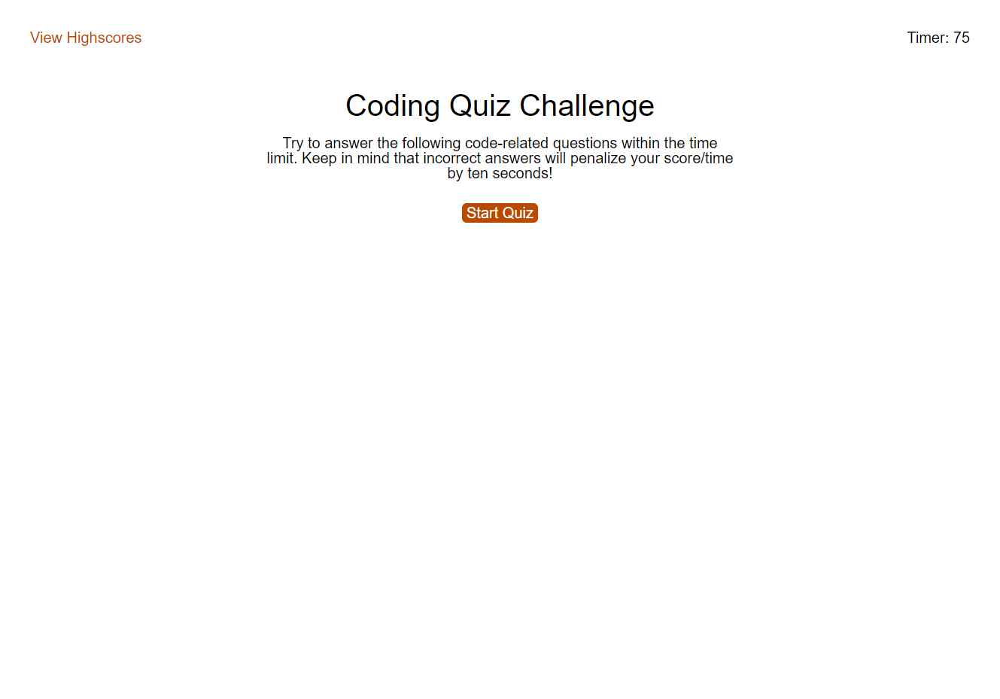

# code-quiz

This is a single page application that functions as a coding quiz challenge.

## Purpose

The purpose of this project was to practice using web APIs in javascript to make updates to the DOM.

## Goal

The goal of this project was to provide a user with a single page application that acted as a coding quiz. At the end of the quiz they could choose to store their score on the locally hosted highscore page.

## Deployment

See below for a screenshot of the application as well as a link to the deployed web page.

https://struelensc.github.io/code-quiz/

## Some Thoughts

In the function `questionResult()`, lines 113-131, there is some repeated code for displaying a message to the user if they chose the correct or wrong answer. I would like optimize this by creating a separate function for displaying this message to the user.

In the `generateHighscores()`, lines 197-212, button that clears local storage and by doing so, clears the highscore board I created a while loop to remove all the children of the highscore table. This also ends up removing the headers for this table as well. To fix I created new elements and appended them to the DOM. In future, I would like to find a better way to handle this so it doesn't remove the labels.